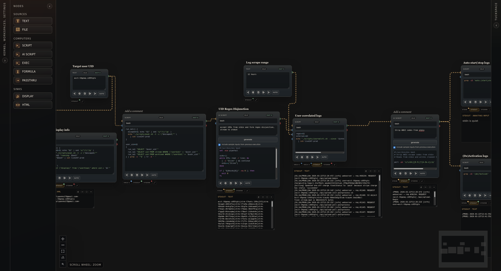

# `shell-ws`

`shell-ws` is an interactive 2d computation workspace



It's a little like a computational notebook (such as [Jupyter](https://jupyter.org/#jupyter-notebook-the-classic-notebook-interface) or [Marimo](https://marimo.io/)), but:

1. For the shell instead of specifically Python; and
2. Computations are represented as explicit graphs, not sequences

Because of the graph representation, `shell-ws` makes it impossible to run a part of your computation without first running its dependencies (unlike Jupyter).

`shell-ws` also offers some extra niceties. One is native AI integration; you can have AI write part of your pipeline on your behalf. Another is that HTML produced by computations can be embedded right into the browser. (This means you can have the output of your computation be an interactive applet!)

## Running it

You can run `shell-ws` right now if you have Nix installed:

```
nix run github:quelklef/shell-ws
```

Then, open your browser to `localhost:4000` (or whatever `nix run` reports)
